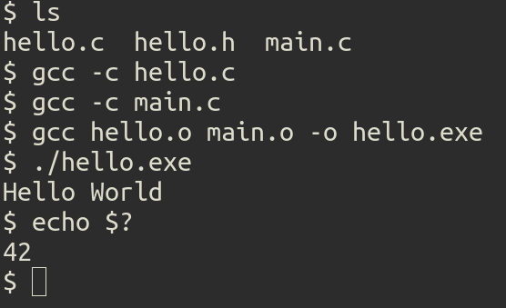
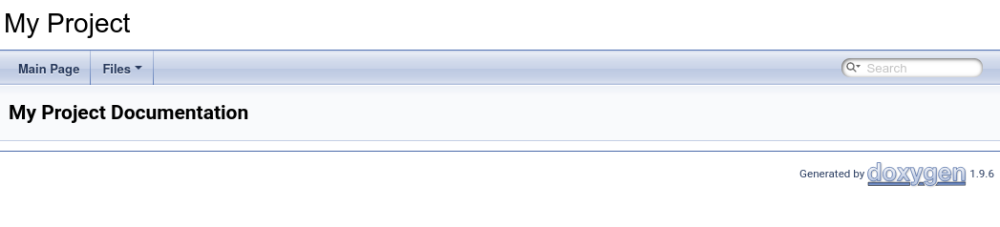
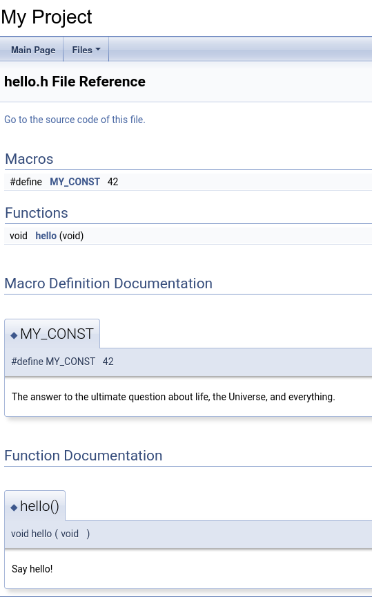
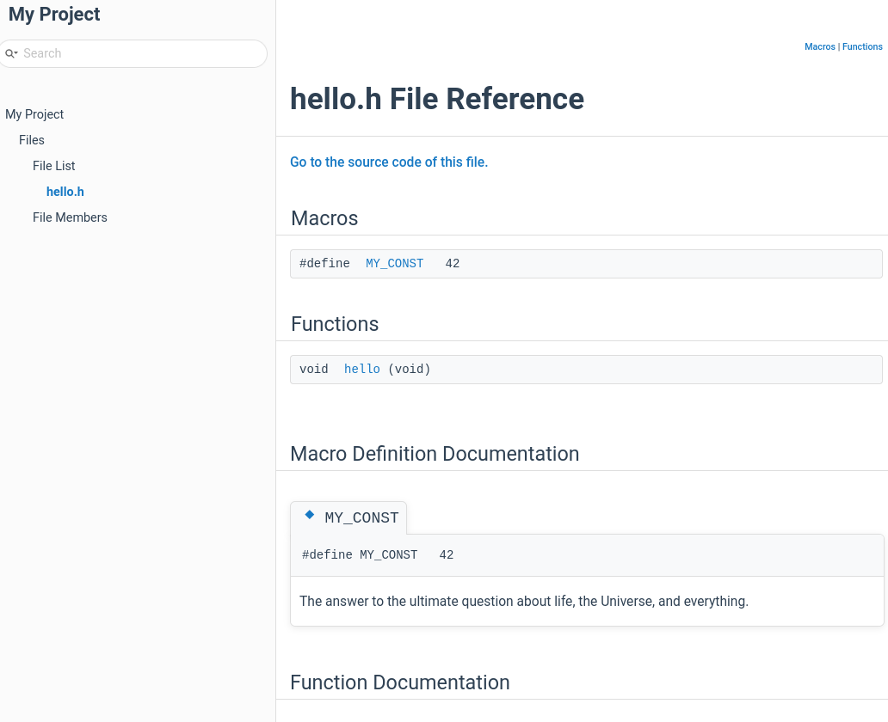

# Documenting C code with Doxygen

Documentation is, without a doubt, a fundamental part of the process of code
development. It allows users and developers have a greater understanding of how
the code works and its use, allowing medium and long-term maintenance to be
carried out faster and that these people can also participate in the project
development.

For C/C++ projects, [Doxygen](https://www.doxygen.nl/) is the most widely used
tool. An example of a project that uses the Doxygen for documentation is
[KDE](https://kde.org/).

Doxygen generates documentation from the code, annotated by blocks of comment
with [special markup](https://www.doxygen.nl/manual/docblocks.html#specialblock),
and can generate output in HTML and LaTeX.[]{#doxygen-how}

Here we will create a simple project in C to exemplify the production of
documentation with Doxygen. The project will be called `hello`, and
contains only one function, which will display `"Hello World"` on the
screen.

# Creating the code for the project

Our project will be very simple, with a flat folder structure (which I named `hello`):

``` {.bash org-language="sh"}
mkdir hello && cd hello && touch hello.c hello.h main.c
```

The contents of the header `hello.h` is

``` {.c org-language="C"}
#ifndef __HELLO_H__
#define __HELLO_H__

#ifndef MY_CONST
#    define MY_CONST 42
#endif

void
hello (void);

#endif /* __HELLO_H__ */
```

and the code for the defined function in `hello.c`

``` {.c org-language="C"}
void
hello (void)
{
    printf ("Hello World\n");
}
```

To call the function `hello` Let's create a file 
`main.c`, containing the main function:

``` {.c org-language="C"}
#include "hello.h"

int main (void)
{
    hello ();
    return MY_CONST;
}
```

We can easily test this code:

``` example
$ gcc -c hello.c 
$ gcc -c main.c 
$ gcc hello.o main.o -o hello.exe
```

Invoking `./hello.exe` prints the message
`Hello World` on screen:


# Installing Doxygen

You can check if Doxygen is installed using the command:

``` example
$ doxygen -v
```

If you haven't installed it, you can look at the [official page of
project](https://www.doxygen.nl/manual/install.html) or on your website
distribution: [Gentoo](https://www.gentoo.org/) users (like me) can install with
[Portage](https://wiki.gentoo.org/wiki/Portage),

``` example
# emerge --ask app-doc/doxygen
```

and for 
[Debian](https://www.debian.org/index.pt.html)/[Ubuntu](https://ubuntu.com/) users,

``` example
# apt-get install doxygen
```

# Creating the documentation

As I [said previously](#doxygen-how), Doxygen uses special annotations in the
code to generate documentation. For our project, we can rewrite the header file
`hello.h` this way:

``` {.c org-language="C"}
/// @file hello.h
#ifndef __HELLO_H__
#define __HELLO_H__

/**
 * The answer to the ultimate question about life, the Universe, and
 * everything.
 */
#ifndef MY_CONST
#    define MY_CONST 42
#endif

/**
 * Say hello!
 */
void
hello (void);

#endif /* __HELLO_H__ */
```

Notice the presence of blocks

``` example
/**
 * ... text ...
 */
```

in the header.

## Creating Doxyfile

`Doxyfile` is the configuration file that controls the
Doxygen. To create a configuration template, run in the directory main project the command:


``` example
$ doxygen -g
```

where the `-g` stands for `generate`. This will create the
`Doxyfile` file in the project directory.

## Invoking Doxygen

To create the documentation invoke the command 

``` example
$ doxygen
```

This will create two new folders:

-   `html/`,
-   `latex/`.

By default, Doxygen create the documentation in
[LaTeX](https://www.latex-project.org/) format, besides the HTML version.

If you open the `html/index.html` file in your browser, you will see
something similar to this:


And by navigatin to the menu `Files > File List > hello.h`, you will see
the documentation of the `hello.h` file:


# Improving the appearance of the documentation

Although the result is functional, the generated page has a pretty barebones look.
To make the appearance a little more attractive, Doxygen offers some [options for
customization](https://www.doxygen.nl/manual/customize.html), and among them
the option to include CSS styles.

To solve this we have the nice [Doxygen
Awesome](https://jothepro.github.io/doxygen-awesome-css/) project, which provides an additional
style layer for our documentation.

To use it there are some installation options on [page
official](https://jothepro.github.io/doxygen-awesome-css/index.html#autotoc_md10),
and I will install it as a git submodule:

``` {.bash org-language="sh"}
git submodule add https://github.com/jothepro/doxygen-awesome-css.git
cd doxygen-awesome-css
git checkout v2.2.1
```

The project offers two layouts, and I will choose the sidebar layout. To do
this, it is also necessary to modify the following options in the
`Doxyfile`:

``` example
GENERATE_TREEVIEW      = YES # required!
DISABLE_INDEX          = NO
FULL_SIDEBAR           = NO
HTML_EXTRA_STYLESHEET  = doxygen-awesome-css/doxygen-awesome.css doxygen-awesome-css/doxygen-awesome-sidebar-only.css
HTML_COLORSTYLE        = LIGHT # required with Doxygen >= 1.9.5
```

And by invoking `doxygen` again, the generated documentation will look
like this: 
